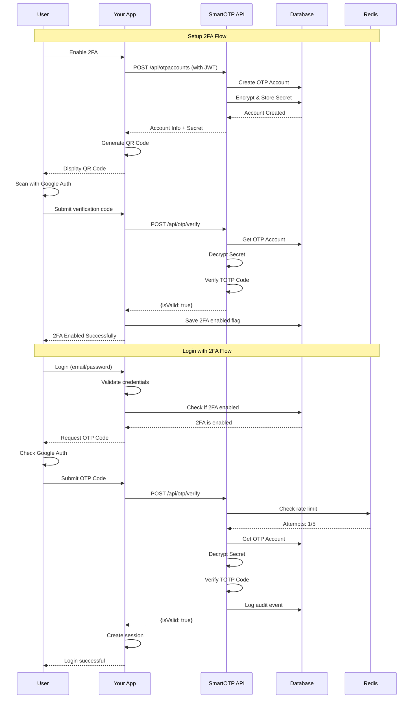

# Hướng Dẫn Tích Hợp 2FA với SmartOTP

## 📋 Tổng Quan

Tài liệu này hướng dẫn chi tiết cách tích hợp xác thực hai yếu tố (2FA - Two-Factor Authentication) từ hệ thống SmartOTP vào ứng dụng/hệ thống của bạn.

SmartOTP cung cấp giải pháp 2FA hoàn chỉnh tương tự như Google Authenticator và Microsoft Authenticator, hỗ trợ cả TOTP (Time-based) và HOTP (Counter-based) theo tiêu chuẩn RFC 6238 và RFC 4226.

## 🏗️ Kiến Trúc Tổng Quan

```
┌─────────────────────────────────────────────────────────────────┐
│                     HỆ THỐNG CỦA BẠN                            │
│  (Ứng dụng Web/Mobile/Desktop cần tích hợp 2FA)                 │
└─────────────────────────────────────────────────────────────────┘
                           ↓ HTTP/HTTPS
                  ┌────────────────────┐
                  │   API Gateway      │
                  │   (Optional)       │
                  └────────────────────┘
                           ↓
┌────────────────────────────────────────────────────────────────┐
│                     SMARTOTP API                               │
│  ┌──────────────┬──────────────┬──────────────┐                │
│  │ Auth API     │ OTP API      │ Accounts API │                │
│  │              │              │              │                │
│  │ /register    │ /generate    │ /create      │                │
│  │ /login       │ /verify      │ /list        │                │
│  │ /refresh     │              │ /delete      │                │
│  └──────────────┴──────────────┴──────────────┘                │
│                                                                │
│  ┌──────────────────────────────────────────────┐              │
│  │         Business Logic Layer                 │              │
│  │  - CQRS Commands & Queries                   │              │
│  │  - MediatR Handlers                          │              │
│  │  - FluentValidation                          │              │
│  └──────────────────────────────────────────────┘              │
│                                                                │
│  ┌──────────────────────────────────────────────┐              │
│  │           Security Services                  │              │
│  │  - OTP Generator (TOTP/HOTP)                 │              │
│  │  - AES-256 Encryption                        │              │
│  │  - JWT Authentication                        │              │
│  │  - Rate Limiting (Redis)                     │              │
│  └──────────────────────────────────────────────┘              │
└────────────────────────────────────────────────────────────────┘
                           ↓
            ┌──────────────────────────────┐
            │  PostgreSQL + Redis          │
            │  (Data + Cache)              │
            └──────────────────────────────┘
```

## 🔄 Luồng Hoạt Động 2FA

### Luồng 1: Đăng Ký và Kích Hoạt 2FA

```
┌──────────┐                ┌──────────────┐              ┌────────────┐
│  User    │                │  Your App    │              │ SmartOTP   │
└────┬─────┘                └──────┬───────┘              └─────┬──────┘
     │                             │                            │
     │ 1. Đăng ký tài khoản        │                            │
     │────────────────────────────>│                            │
     │                             │ 2. Tạo user trong SmartOTP │
     │                             │───────────────────────────>│
     │                             │                            │
     │                             │ 3. JWT tokens + User Info  │
     │                             │<───────────────────────────│
     │                             │                            │
     │ 4. Yêu cầu kích hoạt 2FA    │                            │
     │────────────────────────────>│                            │
     │                             │ 5. Tạo OTP Account         │
     │                             │───────────────────────────>│
     │                             │                            │
     │                             │ 6. Secret Key + QR Code    │
     │                             │<───────────────────────────│
     │                             │    Data (otpauth://)       │
     │                             │                            │
     │ 7. Hiển thị QR Code         │                            │
     │<────────────────────────────│                            │
     │                             │                            │
     │ 8. Quét QR bằng app (GA)    │                            │
     │                             │                            │
     │ 9. Nhập mã OTP xác nhận     │                            │
     │────────────────────────────>│                            │
     │                             │ 10. Verify OTP             │
     │                             │───────────────────────────>│
     │                             │                            │
     │                             │ 11. {isValid: true}        │
     │                             │<───────────────────────────│
     │                             │                            │
     │ 12. Kích hoạt 2FA thành công│                            │
     │<────────────────────────────│                            │
```

### Luồng 2: Đăng Nhập với 2FA

```
┌──────────┐                ┌──────────────┐              ┌────────────┐
│  User    │                │  Your App    │              │ SmartOTP   │
└────┬─────┘                └──────┬───────┘              └─────┬──────┘
     │                             │                            │
     │ 1. Nhập email/password      │                            │
     │────────────────────────────>│                            │
     │                             │ 2. Login request           │
     │                             │───────────────────────────>│
     │                             │                            │
     │                             │ 3. JWT tokens (hoặc error) │
     │                             │<───────────────────────────│
     │                             │                            │
     │                             │ 4. Kiểm tra 2FA enabled    │
     │                             │    (trong DB của bạn)      │
     │                             │                            │
     │ 5. Yêu cầu nhập OTP         │                            │
     │<────────────────────────────│                            │
     │                             │                            │
     │ 6. Nhập mã OTP từ app       │                            │
     │────────────────────────────>│                            │
     │                             │ 7. Verify OTP              │
     │                             │───────────────────────────>│
     │                             │                            │
     │                             │ 8. {isValid: true/false}   │
     │                             │<───────────────────────────│
     │                             │                            │
     │ 9. Đăng nhập thành công     │                            │
     │    hoặc thất bại            │                            │
     │<────────────────────────────│                            │
```

### Luồng 3: Xác Thực Giao Dịch Quan Trọng

```
┌──────────┐                ┌──────────────┐              ┌────────────┐
│  User    │                │  Your App    │              │ SmartOTP   │
└────┬─────┘                └──────┬───────┘              └─────┬──────┘
     │                             │                            │
     │ 1. Thực hiện giao dịch      │                            │
     │    quan trọng               │                            │
     │────────────────────────────>│                            │
     │                             │                            │
     │ 2. Yêu cầu xác nhận OTP     │                            │
     │<────────────────────────────│                            │
     │                             │                            │
     │ 3. Nhập mã OTP              │                            │
     │────────────────────────────>│                            │
     │                             │ 4. Verify OTP              │
     │                             │───────────────────────────>│
     │                             │                            │
     │                             │ 5. {isValid: true/false}   │
     │                             │<───────────────────────────│
     │                             │                            │
     │                             │ 6. Thực hiện giao dịch     │
     │                             │    nếu OTP hợp lệ          │
     │                             │                            │
     │ 7. Kết quả giao dịch        │                            │
     │<────────────────────────────│                            │
```

## 🔐 Chi Tiết API Endpoints

### 1. Đăng Ký User trong SmartOTP

**Endpoint:** `POST /api/auth/register`

**Headers:**
```
Content-Type: application/json
```

**Request Body:**
```json
{
  "email": "user@example.com",
  "password": "SecurePassword123!",
  "firstName": "John",
  "lastName": "Doe"
}
```

**Response:** `200 OK`
```json
{
  "accessToken": "eyJhbGciOiJIUzI1NiIsInR5cCI6IkpXVCJ9...",
  "refreshToken": "base64_encoded_refresh_token",
  "accessTokenExpiresAt": "2025-11-21T13:00:00Z",
  "refreshTokenExpiresAt": "2025-11-28T12:00:00Z",
  "user": {
    "id": "3fa85f64-5717-4562-b3fc-2c963f66afa6",
    "email": "user@example.com",
    "firstName": "John",
    "lastName": "Doe",
    "isEmailVerified": false,
    "createdAt": "2025-11-21T12:00:00Z"
  }
}
```

### 2. Đăng Nhập

**Endpoint:** `POST /api/auth/login`

**Headers:**
```
Content-Type: application/json
```

**Request Body:**
```json
{
  "email": "user@example.com",
  "password": "SecurePassword123!"
}
```

**Response:** `200 OK` (Same as register)

### 3. Refresh Token

**Endpoint:** `POST /api/auth/refresh-token`

**Headers:**
```
Content-Type: application/json
```

**Request Body:**
```json
{
  "refreshToken": "your_refresh_token_here"
}
```

**Response:** `200 OK` (New tokens)

### 4. Tạo OTP Account (Kích Hoạt 2FA)

**Endpoint:** `POST /api/otpaccounts`

**Headers:**
```
Content-Type: application/json
Authorization: Bearer {accessToken}
```

**Request Body (TOTP - Time-based):**
```json
{
  "issuer": "YourAppName",
  "accountName": "user@example.com",
  "type": "TOTP",
  "algorithm": "SHA1",
  "digits": 6,
  "period": 30
}
```

**Request Body (HOTP - Counter-based):**
```json
{
  "issuer": "YourAppName",
  "accountName": "user@example.com",
  "type": "HOTP",
  "algorithm": "SHA1",
  "digits": 6,
  "counter": 0
}
```

**Response:** `201 Created`
```json
{
  "id": "7c9e6679-7425-40de-944b-e07fc1f90ae7",
  "issuer": "YourAppName",
  "accountName": "user@example.com",
  "type": "TOTP",
  "algorithm": "SHA1",
  "digits": 6,
  "period": 30,
  "counter": 0,
  "sortOrder": 0,
  "createdAt": "2025-11-21T12:00:00Z"
}
```

**Lưu ý:** Sau khi tạo OTP account, bạn cần tạo QR code để user quét. Format:
```
otpauth://totp/YourAppName:user@example.com?secret=BASE32SECRET&issuer=YourAppName&algorithm=SHA1&digits=6&period=30
```

### 5. Lấy Danh Sách OTP Accounts

**Endpoint:** `GET /api/otpaccounts`

**Headers:**
```
Authorization: Bearer {accessToken}
```

**Response:** `200 OK`
```json
[
  {
    "id": "7c9e6679-7425-40de-944b-e07fc1f90ae7",
    "issuer": "YourAppName",
    "accountName": "user@example.com",
    "type": "TOTP",
    "algorithm": "SHA1",
    "digits": 6,
    "period": 30,
    "counter": 0,
    "sortOrder": 0,
    "createdAt": "2025-11-21T12:00:00Z"
  }
]
```

### 6. Generate OTP Code (Dùng cho Backend Testing)

**Endpoint:** `GET /api/otp/generate/{accountId}`

**Headers:**
```
Authorization: Bearer {accessToken}
```

**Response:** `200 OK`
```json
{
  "code": "123456",
  "remainingSeconds": 25,
  "generatedAt": "2025-11-21T12:00:00Z"
}
```

**Lưu ý:** Endpoint này chỉ dùng cho testing. Trong production, user sẽ lấy mã từ Google Authenticator hoặc app tương tự.

### 7. Verify OTP Code (Quan Trọng Nhất)

**Endpoint:** `POST /api/otp/verify`

**Headers:**
```
Content-Type: application/json
Authorization: Bearer {accessToken}
```

**Request Body:**
```json
{
  "accountId": "7c9e6679-7425-40de-944b-e07fc1f90ae7",
  "code": "123456"
}
```

**Response:** `200 OK`
```json
{
  "isValid": true
}
```

**Rate Limiting:**
- Tối đa 5 lần thử trong 5 phút
- Sau 5 lần thất bại, phải đợi 5 phút

**Error Response:** `400 Bad Request`
```json
{
  "message": "Too many verification attempts. Please try again later."
}
```

### 8. Xóa OTP Account (Tắt 2FA)

**Endpoint:** `DELETE /api/otpaccounts/{accountId}`

**Headers:**
```
Authorization: Bearer {accessToken}
```

**Response:** `204 No Content`

## 💻 Ví Dụ Code Tích Hợp

### 1. Tích Hợp với ASP.NET Core

```csharp
// Services/SmartOtpService.cs
public class SmartOtpService : ISmartOtpService
{
    private readonly HttpClient _httpClient;
    private readonly IConfiguration _configuration;
    
    public SmartOtpService(HttpClient httpClient, IConfiguration configuration)
    {
        _httpClient = httpClient;
        _configuration = configuration;
        _httpClient.BaseAddress = new Uri(_configuration["SmartOtp:ApiUrl"]);
    }
    
    // Tạo OTP Account cho user
    public async Task<OtpAccountDto> EnableTwoFactorAsync(string accessToken, string email)
    {
        _httpClient.DefaultRequestHeaders.Authorization = 
            new AuthenticationHeaderValue("Bearer", accessToken);
            
        var request = new
        {
            issuer = "YourAppName",
            accountName = email,
            type = "TOTP",
            algorithm = "SHA1",
            digits = 6,
            period = 30
        };
        
        var response = await _httpClient.PostAsJsonAsync("/api/otpaccounts", request);
        response.EnsureSuccessStatusCode();
        
        return await response.Content.ReadFromJsonAsync<OtpAccountDto>();
    }
    
    // Verify OTP code
    public async Task<bool> VerifyOtpAsync(string accessToken, Guid accountId, string code)
    {
        _httpClient.DefaultRequestHeaders.Authorization = 
            new AuthenticationHeaderValue("Bearer", accessToken);
            
        var request = new { accountId, code };
        
        var response = await _httpClient.PostAsJsonAsync("/api/otp/verify", request);
        
        if (!response.IsSuccessStatusCode)
        {
            return false;
        }
        
        var result = await response.Content.ReadFromJsonAsync<VerifyResult>();
        return result?.IsValid ?? false;
    }
    
    // Generate QR Code URL
    public string GenerateQrCodeUrl(string secret, string issuer, string accountName)
    {
        var otpAuthUrl = $"otpauth://totp/{Uri.EscapeDataString(issuer)}:{Uri.EscapeDataString(accountName)}" +
                        $"?secret={secret}" +
                        $"&issuer={Uri.EscapeDataString(issuer)}" +
                        $"&algorithm=SHA1&digits=6&period=30";
        
        // Sử dụng service như QRCoder hoặc API như api.qrserver.com
        return $"https://api.qrserver.com/v1/create-qr-code/?size=300x300&data={Uri.EscapeDataString(otpAuthUrl)}";
    }
}

// Controllers/AccountController.cs
[ApiController]
[Route("api/[controller]")]
public class AccountController : ControllerBase
{
    private readonly ISmartOtpService _otpService;
    
    [HttpPost("enable-2fa")]
    [Authorize]
    public async Task<IActionResult> EnableTwoFactor()
    {
        var email = User.FindFirst(ClaimTypes.Email)?.Value;
        var accessToken = Request.Headers["Authorization"].ToString().Replace("Bearer ", "");
        
        // Tạo OTP account trong SmartOTP
        var otpAccount = await _otpService.EnableTwoFactorAsync(accessToken, email);
        
        // Lưu accountId vào database của bạn
        await SaveUserOtpAccountId(User.GetUserId(), otpAccount.Id);
        
        // Tạo QR code URL (secret được trả về từ SmartOTP - cần thêm vào response)
        var qrCodeUrl = _otpService.GenerateQrCodeUrl(
            otpAccount.Secret, // Cần thêm field này vào response
            otpAccount.Issuer,
            otpAccount.AccountName
        );
        
        return Ok(new { otpAccount, qrCodeUrl });
    }
    
    [HttpPost("verify-2fa")]
    [Authorize]
    public async Task<IActionResult> VerifyTwoFactor([FromBody] VerifyRequest request)
    {
        var accessToken = Request.Headers["Authorization"].ToString().Replace("Bearer ", "");
        var otpAccountId = await GetUserOtpAccountId(User.GetUserId());
        
        var isValid = await _otpService.VerifyOtpAsync(accessToken, otpAccountId, request.Code);
        
        if (!isValid)
        {
            return Unauthorized(new { message = "Invalid OTP code" });
        }
        
        return Ok(new { message = "2FA verification successful" });
    }
}
```

### 2. Tích Hợp với Node.js/Express

```javascript
// services/smartOtpService.js
const axios = require('axios');

class SmartOtpService {
  constructor() {
    this.apiUrl = process.env.SMARTOTP_API_URL || 'http://localhost:5000';
    this.client = axios.create({
      baseURL: this.apiUrl,
      headers: {
        'Content-Type': 'application/json'
      }
    });
  }
  
  // Đăng ký user trong SmartOTP
  async registerUser(email, password, firstName, lastName) {
    const response = await this.client.post('/api/auth/register', {
      email,
      password,
      firstName,
      lastName
    });
    return response.data;
  }
  
  // Login
  async login(email, password) {
    const response = await this.client.post('/api/auth/login', {
      email,
      password
    });
    return response.data;
  }
  
  // Kích hoạt 2FA
  async enableTwoFactor(accessToken, email) {
    const response = await this.client.post('/api/otpaccounts', {
      issuer: 'YourAppName',
      accountName: email,
      type: 'TOTP',
      algorithm: 'SHA1',
      digits: 6,
      period: 30
    }, {
      headers: {
        'Authorization': `Bearer ${accessToken}`
      }
    });
    return response.data;
  }
  
  // Verify OTP
  async verifyOtp(accessToken, accountId, code) {
    try {
      const response = await this.client.post('/api/otp/verify', {
        accountId,
        code
      }, {
        headers: {
          'Authorization': `Bearer ${accessToken}`
        }
      });
      return response.data.isValid;
    } catch (error) {
      if (error.response?.status === 400) {
        throw new Error(error.response.data.message);
      }
      throw error;
    }
  }
  
  // Generate QR Code URL
  generateQrCodeUrl(secret, issuer, accountName) {
    const otpAuthUrl = `otpauth://totp/${encodeURIComponent(issuer)}:${encodeURIComponent(accountName)}` +
                      `?secret=${secret}` +
                      `&issuer=${encodeURIComponent(issuer)}` +
                      `&algorithm=SHA1&digits=6&period=30`;
    
    return `https://api.qrserver.com/v1/create-qr-code/?size=300x300&data=${encodeURIComponent(otpAuthUrl)}`;
  }
}

module.exports = new SmartOtpService();

// routes/auth.js
const express = require('express');
const router = express.Router();
const smartOtpService = require('../services/smartOtpService');
const authMiddleware = require('../middleware/auth');

// Kích hoạt 2FA
router.post('/enable-2fa', authMiddleware, async (req, res) => {
  try {
    const { email } = req.user;
    const accessToken = req.headers.authorization.replace('Bearer ', '');
    
    // Tạo OTP account
    const otpAccount = await smartOtpService.enableTwoFactor(accessToken, email);
    
    // Lưu accountId vào database
    await saveUserOtpAccountId(req.user.id, otpAccount.id);
    
    // Tạo QR code URL
    const qrCodeUrl = smartOtpService.generateQrCodeUrl(
      otpAccount.secret, // Cần thêm vào response
      otpAccount.issuer,
      otpAccount.accountName
    );
    
    res.json({ otpAccount, qrCodeUrl });
  } catch (error) {
    res.status(500).json({ message: error.message });
  }
});

// Verify 2FA
router.post('/verify-2fa', authMiddleware, async (req, res) => {
  try {
    const { code } = req.body;
    const accessToken = req.headers.authorization.replace('Bearer ', '');
    const otpAccountId = await getUserOtpAccountId(req.user.id);
    
    const isValid = await smartOtpService.verifyOtp(accessToken, otpAccountId, code);
    
    if (!isValid) {
      return res.status(401).json({ message: 'Invalid OTP code' });
    }
    
    res.json({ message: '2FA verification successful' });
  } catch (error) {
    res.status(500).json({ message: error.message });
  }
});

module.exports = router;
```

### 3. Tích Hợp với Python/FastAPI

```python
# services/smart_otp_service.py
import httpx
from typing import Optional
from urllib.parse import quote

class SmartOtpService:
    def __init__(self, api_url: str):
        self.api_url = api_url
        self.client = httpx.AsyncClient(base_url=api_url)
    
    async def register_user(self, email: str, password: str, 
                          first_name: str, last_name: str) -> dict:
        response = await self.client.post('/api/auth/register', json={
            'email': email,
            'password': password,
            'firstName': first_name,
            'lastName': last_name
        })
        response.raise_for_status()
        return response.json()
    
    async def login(self, email: str, password: str) -> dict:
        response = await self.client.post('/api/auth/login', json={
            'email': email,
            'password': password
        })
        response.raise_for_status()
        return response.json()
    
    async def enable_two_factor(self, access_token: str, email: str) -> dict:
        response = await self.client.post('/api/otpaccounts', 
            json={
                'issuer': 'YourAppName',
                'accountName': email,
                'type': 'TOTP',
                'algorithm': 'SHA1',
                'digits': 6,
                'period': 30
            },
            headers={'Authorization': f'Bearer {access_token}'}
        )
        response.raise_for_status()
        return response.json()
    
    async def verify_otp(self, access_token: str, 
                        account_id: str, code: str) -> bool:
        try:
            response = await self.client.post('/api/otp/verify',
                json={'accountId': account_id, 'code': code},
                headers={'Authorization': f'Bearer {access_token}'}
            )
            response.raise_for_status()
            result = response.json()
            return result.get('isValid', False)
        except httpx.HTTPStatusError as e:
            if e.response.status_code == 400:
                raise ValueError(e.response.json().get('message'))
            raise
    
    def generate_qr_code_url(self, secret: str, issuer: str, 
                            account_name: str) -> str:
        otpauth_url = (
            f"otpauth://totp/{quote(issuer)}:{quote(account_name)}"
            f"?secret={secret}"
            f"&issuer={quote(issuer)}"
            f"&algorithm=SHA1&digits=6&period=30"
        )
        return f"https://api.qrserver.com/v1/create-qr-code/?size=300x300&data={quote(otpauth_url)}"

# routers/auth.py
from fastapi import APIRouter, Depends, HTTPException, Header
from services.smart_otp_service import SmartOtpService

router = APIRouter()
otp_service = SmartOtpService(api_url="http://localhost:5000")

@router.post("/enable-2fa")
async def enable_two_factor(
    authorization: str = Header(...)
):
    try:
        access_token = authorization.replace("Bearer ", "")
        # Get user email from your auth system
        email = get_current_user_email(access_token)
        
        # Create OTP account
        otp_account = await otp_service.enable_two_factor(access_token, email)
        
        # Save account ID to your database
        await save_user_otp_account_id(user_id, otp_account['id'])
        
        # Generate QR code URL
        qr_code_url = otp_service.generate_qr_code_url(
            otp_account['secret'],  # Need to add this field to response
            otp_account['issuer'],
            otp_account['accountName']
        )
        
        return {
            'otpAccount': otp_account,
            'qrCodeUrl': qr_code_url
        }
    except Exception as e:
        raise HTTPException(status_code=500, detail=str(e))

@router.post("/verify-2fa")
async def verify_two_factor(
    code: str,
    authorization: str = Header(...)
):
    try:
        access_token = authorization.replace("Bearer ", "")
        # Get user OTP account ID from your database
        otp_account_id = await get_user_otp_account_id(user_id)
        
        is_valid = await otp_service.verify_otp(access_token, otp_account_id, code)
        
        if not is_valid:
            raise HTTPException(status_code=401, detail="Invalid OTP code")
        
        return {'message': '2FA verification successful'}
    except ValueError as e:
        raise HTTPException(status_code=400, detail=str(e))
    except Exception as e:
        raise HTTPException(status_code=500, detail=str(e))
```

## 🎯 Các Trường Hợp Sử Dụng Phổ Biến

### 1. Đăng Nhập với 2FA Bắt Buộc

```
1. User nhập email/password
2. Hệ thống xác thực thông tin đăng nhập
3. Kiểm tra user có bật 2FA không (trong DB của bạn)
4. Nếu có:
   a. Yêu cầu nhập OTP code
   b. User nhập code từ Google Authenticator
   c. Gọi SmartOTP API để verify code
   d. Nếu hợp lệ: Tạo session/token và cho phép đăng nhập
   e. Nếu không hợp lệ: Từ chối và yêu cầu nhập lại
5. Nếu không có 2FA: Đăng nhập bình thường
```

### 2. 2FA Tùy Chọn (Optional)

```
1. User đăng nhập thành công
2. Trong trang cài đặt tài khoản, có option "Enable 2FA"
3. User click "Enable 2FA":
   a. Gọi SmartOTP API để tạo OTP account
   b. Hiển thị QR code cho user quét
   c. Yêu cầu user nhập code để xác nhận đã quét thành công
   d. Verify code qua SmartOTP API
   e. Nếu hợp lệ: Lưu trạng thái 2FA enabled vào DB
4. Lần đăng nhập tiếp theo sẽ yêu cầu OTP
```

### 3. Xác Thực Giao Dịch Quan Trọng

```
1. User thực hiện giao dịch nhạy cảm (chuyển tiền, đổi mật khẩu, etc.)
2. Hiển thị popup yêu cầu nhập OTP
3. User nhập OTP code
4. Verify code qua SmartOTP API
5. Nếu hợp lệ: Thực hiện giao dịch
6. Nếu không hợp lệ: Từ chối và log lại
```

### 4. Step-up Authentication

```
1. User đã đăng nhập bình thường (không có 2FA)
2. Khi truy cập tính năng nhạy cảm:
   a. Kiểm tra user có OTP account không
   b. Nếu có: Yêu cầu verify OTP trước khi cho phép
   c. Nếu không: Yêu cầu enable 2FA trước
```

## 📱 Ứng Dụng Authenticator Tương Thích

SmartOTP tương thích với tất cả các ứng dụng hỗ trợ TOTP/HOTP theo chuẩn RFC:

- **Google Authenticator** (iOS/Android)
- **Microsoft Authenticator** (iOS/Android)
- **Authy** (iOS/Android/Desktop)
- **1Password** (có tính năng TOTP)
- **LastPass Authenticator**
- **FreeOTP** (Open source)
- **andOTP** (Android, open source)

## 🔒 Best Practices

### 1. Bảo Mật

- ✅ **HTTPS Only**: Luôn sử dụng HTTPS khi giao tiếp với SmartOTP API
- ✅ **Lưu trữ Token an toàn**: Không lưu access token ở client-side lâu dài
- ✅ **Rate Limiting**: SmartOTP đã có rate limiting, nhưng nên implement thêm ở app của bạn
- ✅ **Backup Codes**: Cung cấp backup codes cho user khi mất điện thoại
- ✅ **Audit Log**: Log tất cả các hoạt động 2FA (enable/disable/verify)

### 2. User Experience

- ✅ **Hướng dẫn rõ ràng**: Cung cấp hướng dẫn chi tiết cách quét QR code
- ✅ **Hiển thị thời gian còn lại**: Cho TOTP, hiển thị countdown
- ✅ **Multiple devices**: Cho phép user có nhiều OTP account cho cùng 1 tài khoản
- ✅ **Recovery mechanism**: Có phương án khôi phục khi mất OTP device
- ✅ **Clear error messages**: Thông báo lỗi rõ ràng khi verify fail

### 3. Database Schema

Trong database của bạn, nên có bảng lưu thông tin:

```sql
CREATE TABLE user_two_factor (
    id UUID PRIMARY KEY,
    user_id UUID NOT NULL REFERENCES users(id),
    smartotp_account_id UUID NOT NULL, -- ID từ SmartOTP
    is_enabled BOOLEAN DEFAULT false,
    enabled_at TIMESTAMP,
    backup_codes TEXT[], -- Mã backup
    created_at TIMESTAMP DEFAULT NOW(),
    updated_at TIMESTAMP DEFAULT NOW()
);

-- Index
CREATE INDEX idx_user_two_factor_user_id ON user_two_factor(user_id);
```

### 4. Error Handling

```csharp
public async Task<bool> VerifyOtpSafely(string accessToken, Guid accountId, string code)
{
    try
    {
        return await _otpService.VerifyOtpAsync(accessToken, accountId, code);
    }
    catch (HttpRequestException ex) when (ex.StatusCode == HttpStatusCode.BadRequest)
    {
        // Rate limit hoặc invalid input
        _logger.LogWarning("OTP verification failed: {Message}", ex.Message);
        return false;
    }
    catch (HttpRequestException ex) when (ex.StatusCode == HttpStatusCode.Unauthorized)
    {
        // Token hết hạn, cần refresh
        var newToken = await RefreshAccessToken();
        return await _otpService.VerifyOtpAsync(newToken, accountId, code);
    }
    catch (Exception ex)
    {
        _logger.LogError(ex, "Error verifying OTP");
        throw;
    }
}
```

## 🚀 Triển Khai Production

### 1. Infrastructure

```yaml
# docker-compose.yml (Your App)
version: '3.8'
services:
  your-app:
    image: your-app:latest
    environment:
      - SMARTOTP_API_URL=https://smartotp.yourdomain.com
    depends_on:
      - smartotp
  
  smartotp:
    image: smartotp:latest
    environment:
      - ConnectionStrings__DefaultConnection=...
      - ConnectionStrings__Redis=...
      - Jwt__Secret=...
      - Encryption__Key=...
    ports:
      - "5000:5000"
```

### 2. Environment Variables

```bash
# .env
SMARTOTP_API_URL=https://smartotp.yourdomain.com
SMARTOTP_TIMEOUT_SECONDS=30
```

### 3. Health Check

```csharp
public async Task<bool> CheckSmartOtpHealth()
{
    try
    {
        var response = await _httpClient.GetAsync("/health");
        return response.IsSuccessStatusCode;
    }
    catch
    {
        return false;
    }
}
```

### 4. Monitoring

Theo dõi các metrics:
- Số lượng verify requests
- Tỷ lệ verify thành công/thất bại
- Response time của SmartOTP API
- Số lượng rate limit hits

## 📞 Troubleshooting

### Lỗi Thường Gặp

#### 1. "Too many verification attempts"
**Nguyên nhân:** User đã thử sai OTP quá 5 lần trong 5 phút
**Giải pháp:** Đợi 5 phút hoặc clear cache Redis

#### 2. "OTP account not found"
**Nguyên nhân:** AccountId không tồn tại hoặc không thuộc user hiện tại
**Giải pháp:** Kiểm tra lại accountId trong database

#### 3. "Invalid OTP code"
**Nguyên nhân:** 
- Code đã hết hạn (TOTP)
- Clock skew giữa server và device
- User nhập sai code

**Giải pháp:**
- Đảm bảo server time đồng bộ (NTP)
- TOTP có window = 1 (cho phép ±30s)
- Yêu cầu user nhập lại

#### 4. "Unauthorized"
**Nguyên nhân:** JWT token hết hạn
**Giải pháp:** Refresh token và thử lại

## 📊 Sequence Diagram Đầy Đủ



## 🔗 Resources

- **RFC 6238**: TOTP Specification - https://tools.ietf.org/html/rfc6238
- **RFC 4226**: HOTP Specification - https://tools.ietf.org/html/rfc4226
- **Google Authenticator**: https://support.google.com/accounts/answer/1066447
- **QR Code Generator**: https://goqr.me/api/
- **SmartOTP Repository**: [Your GitHub Repo]

## 📝 Kết Luận

SmartOTP cung cấp giải pháp 2FA hoàn chỉnh, dễ tích hợp và bảo mật cao. Với kiến trúc Clean Architecture và DDD, hệ thống đảm bảo:

- ✅ Tuân thủ chuẩn RFC 6238/4226
- ✅ Bảo mật với AES-256 encryption
- ✅ Rate limiting để chống brute force
- ✅ Audit logging đầy đủ
- ✅ Dễ dàng scale và maintain

Hãy tuân thủ các best practices và thực hiện testing kỹ lưỡng trước khi deploy lên production.

## 📧 Support

Nếu gặp vấn đề khi tích hợp, vui lòng tạo issue trên GitHub hoặc liên hệ qua email.

---

**Version:** 1.0  
**Last Updated:** 2025-11-21  
**Author:** SmartOTP Team
